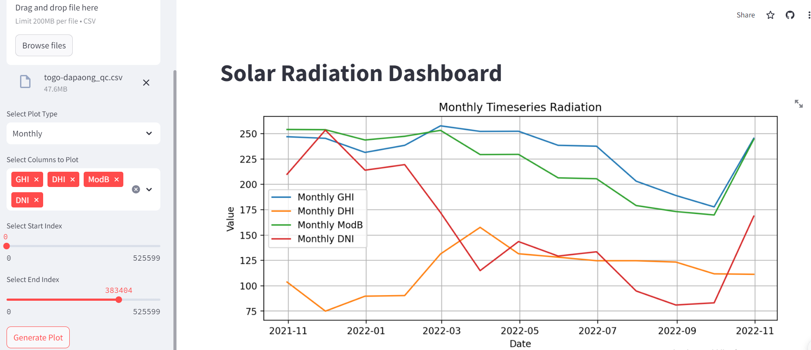

# SolarRadiation_data_analysis

## Solar Farm Data Analysis for Benin, Sierra Leone, and Togo
This repository contains the analysis, documentation, and code for a project focused on analyzing solar farm data from Benin, Sierra Leone, and Togo. This project is part of the evaluation for a 10Akademy Kifya training program in Data Engineering (DE), Financial Analytics (FA), and Machine Learning Engineering (MLE).

## Project Overview
The objective of this project is to conduct an exploratory data analysis (EDA) on environmental data from the specified regions. The aim is to derive actionable insights that can inform strategic decisions regarding the optimal locations for solar farms. Additionally, this project involves developing a Streamlit dashboard to visualize and present these insights in an interactive manner.

## Repository Contents
* Exploratory Data Analysis (EDA): Detailed analysis of the environmental data to identify trends, patterns, and correlations that could influence the selection of solar farm locations.

* Statistical Analysis: Application of statistical techniques to ensure data-driven decision-making, supporting the identification of the best possible sites for solar farms.

* Streamlit Dashboard: An interactive dashboard built with Streamlit to showcase key insights and provide stakeholders with an easy-to-use tool for exploring the analysis results.

Check out the interactive dashboard for this project:

[Open Streamlit Dashboard](https://solarradiationdataanalysis.streamlit.app)




## Prerequisites
* Python 3.x: Ensure Python is installed on your system.
* Virtual Environment: Recommended for managing project dependencies.
* Required Libraries:
> pandas: Data manipulation and analysis.
> numpy: Numerical operations.
> matplotlib: Data visualization.
> seaborn: Statistical visualizations.

Installation

1. **Create a virtual environment:**

   On macOS/Linux:
   ```
   python -m venv venv 
   source venv/bin/activate
   ```
   on windows:

   ```
   python -m venv venv
   venv\Scripts\activate
   ```

2. **Install dependencies:**   
   ``` pip install -r requirements.txt
   ```
**Contributing**

Contributions are welcome!

**License**

This project is licensed under the Apache License. See the LICENSE file for more details.